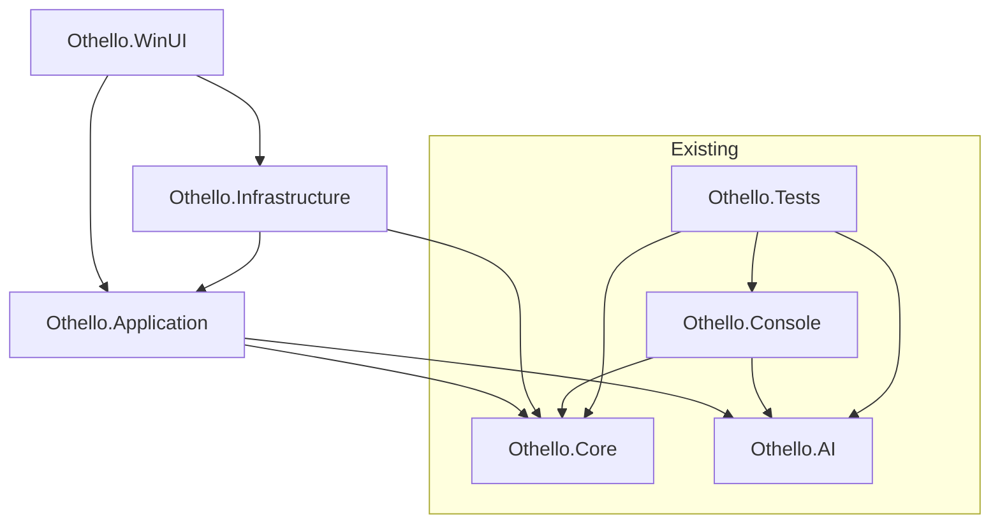
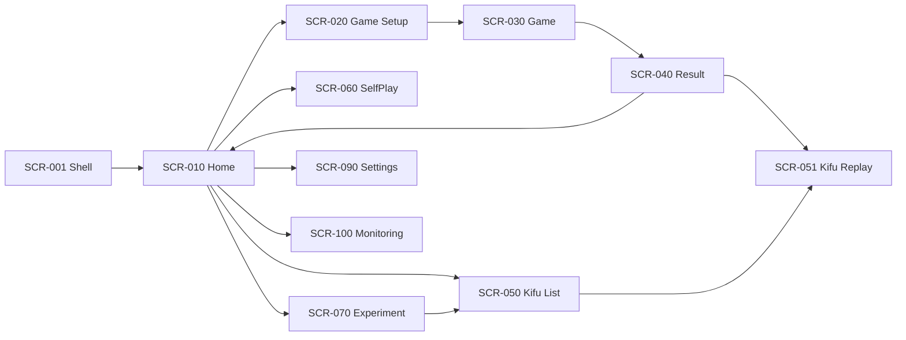

# OthelloAI WinUI GUI 全体設計書（実装前）

## 0. 目的と設計方針
- 目的: 既存 `Othello.Core` / `Othello.AI` を活用し、WinUI フロントエンドを追加する。
- 方針: **MVVM + DI + 疎結合サービス設計**で、AI研究プラットフォームとして5年後まで拡張可能な構成にする。
- 非目標（本フェーズ）: 実装、画面作成、API接続、学習機能の本体実装。

---

## 1. 画面一覧
| 画面ID | 画面名 | 主目的 | 主な責務 |
|---|---|---|---|
| SCR-001 | 起動画面 / Shell | ナビゲーション枠提供 | メニュー、タイトル、共通ステータス |
| SCR-010 | ホームダッシュボード | 利用導線の集約 | 新規対局、自己対戦、解析、設定への遷移 |
| SCR-020 | 対局設定 | 人/AI対局条件の指定 | 先手後手、AI種別、探索深さ、持ち時間 |
| SCR-030 | 対局画面 | 実プレイ | 盤面表示、合法手表示、着手、パス、終局判定 |
| SCR-040 | 対局結果 | 結果確認 | 勝敗、石数、棋譜保存、再生遷移 |
| SCR-050 | 棋譜一覧 | 棋譜資産管理 | 検索、タグ、日付、対局種別フィルタ |
| SCR-051 | 棋譜詳細/再生 | 棋譜分析 | 手順再生、局面ジャンプ、評価値表示 |
| SCR-060 | 自己対戦ジョブ管理 | 研究用バッチ実行 | 対局数、並列度、進捗、停止、出力先 |
| SCR-070 | 実験管理（AI比較） | 比較実験 | AIペア設定、重み差分、結果統計 |
| SCR-080 | モデル管理（将来） | ONNXモデル管理 | モデル登録、有効化、メタデータ管理 |
| SCR-090 | 設定 | アプリ設定 | テーマ、言語、ログ、データ保存先 |
| SCR-100 | ログ/監視 | 運用可視化 | 実行ログ、エラー、パフォーマンス指標 |

---

## 2. 画面遷移図（テキスト）
- 起動 → ホーム
- ホーム → 対局設定 → 対局画面 → 対局結果
- 対局結果 → 棋譜詳細/再生 or ホーム
- ホーム → 棋譜一覧 → 棋譜詳細/再生
- ホーム → 自己対戦ジョブ管理
- ホーム → 実験管理
- ホーム → 設定
- ホーム → ログ/監視
- 実験管理 → 棋譜一覧（結果参照）

---

## 3. MVVM構成図（論理）
- View: XAML画面（表示と入力のみ）
- ViewModel: 画面状態、コマンド、非同期処理、バリデーション
- Model: `Othello.Core` の `Board` / `Move` / `Disc`、`Othello.AI` の `IOthelloAI`
- Service: 対局進行、AI解決、棋譜保存、ジョブ制御、設定、ログ
- Infrastructure: 永続化、ファイルI/O、将来のDB/クラウド連携

責務分離ルール:
1. View はドメインロジックを持たない。
2. ViewModel は `Board` の内部構造を直接変更せず、サービス経由で操作する。
3. Board表現は現行どおり2次元配列を前提にしつつ、将来 BitBoard 差し替え可能な抽象境界を設ける。

---

## 4. DI構成

### 4.1 想定DIコンテナ
- `Microsoft.Extensions.DependencyInjection`
- 起動時に Composition Root（`App.xaml.cs` 相当）で登録

### 4.2 ライフタイム方針
- Singleton: 設定、ログ、ナビゲーション、AIレジストリ、棋譜リポジトリ
- Transient: 各 ViewModel（画面遷移ごと生成）
- Scoped相当（手動管理）: 対局セッション、自己対戦ジョブ

### 4.3 登録方針
- `I*Service` → `*Service`
- `I*Repository` → `*Repository`
- `ICommandFactory` / `IAIFactory` で動的生成
- Named/Keyed registration で AI 実装切替（Random/Greedy/Minimax/AlphaBeta/Mcts/NeuralOnnx）

---

## 5. フォルダ構成（提案）

```text
/Othello.WinUI
  /App
	App.xaml
	App.xaml.cs
	ServiceCollectionExtensions.cs
  /Views
	ShellPage.xaml
	HomePage.xaml
	GameSetupPage.xaml
	GamePage.xaml
	ResultPage.xaml
	KifuListPage.xaml
	KifuReplayPage.xaml
	SelfPlayPage.xaml
	ExperimentPage.xaml
	SettingsPage.xaml
	MonitoringPage.xaml
  /ViewModels
	ShellViewModel.cs
	HomeViewModel.cs
	GameSetupViewModel.cs
	GameViewModel.cs
	ResultViewModel.cs
	KifuListViewModel.cs
	KifuReplayViewModel.cs
	SelfPlayViewModel.cs
	ExperimentViewModel.cs
	SettingsViewModel.cs
	MonitoringViewModel.cs
  /Services
	Interfaces/
	Implementations/
  /Models
	UiModels/
	Dtos/
  /Converters
  /Behaviors
  /Resources
  /Themes
  /Navigation

/Othello.Application
  /Services
  /UseCases
  /Abstractions

/Othello.Infrastructure
  /Persistence
  /Logging
  /FileSystem
  /Configuration

/Othello.Core       (既存)
/Othello.AI         (既存)
/Othello.Tests      (既存 + 追加)
```

---

## 6. プロジェクト参照図（現状 + 追加後）

### 現状
- `Othello.AI` → `Othello.Core`
- `Othello.Console` → `Othello.Core`, `Othello.AI`
- `Othello.Tests` → `Othello.Core`, `Othello.AI`, `Othello.Console`

### 追加後（提案）
- `Othello.WinUI` → `Othello.Application`
- `Othello.Application` → `Othello.Core`, `Othello.AI`
- `Othello.Infrastructure` → `Othello.Application`, `Othello.Core`
- `Othello.WinUI` → `Othello.Infrastructure`（起動時配線のみ）
- `Othello.Tests` → 必要に応じ `Othello.Application`, `Othello.Infrastructure`

依存方向の原則:
- UI → Application → Core
- Infrastructure は抽象を実装し、上位への逆依存を作らない。

---

## 7. Service一覧（提案）
| サービス | 役割 | 主な依存 |
|---|---|---|
| INavigationService | 画面遷移管理 | Frame/Router |
| IGameSessionService | 対局状態管理（開始/着手/終局） | Othello.Core |
| IAiSelectionService | AI選択/生成 | Othello.AI |
| IAiThinkingService | 非同期思考実行・キャンセル | IOthelloAI |
| IKifuService | 棋譜保存/読込/検索 | Repository |
| ISelfPlayService | 自己対戦実行制御 | IGameSessionService, IAiSelectionService |
| IExperimentService | AI比較実験の実行/集計 | ISelfPlayService |
| ISettingsService | 設定保存/読込 | IConfigurationStore |
| INotificationService | トースト/ダイアログ表示 | UI基盤 |
| ILoggingService | 構造化ログ出力 | Logger |
| IMetricsService | 指標収集（NPS以外） | Telemetry基盤 |
| IBoardRendererService | 盤面表示用変換（UIモデル化） | Othello.Core |

---

## 8. ViewModel一覧（提案）
| ViewModel | 主責務 |
|---|---|
| ShellViewModel | グローバルナビゲーション、共通コマンド |
| HomeViewModel | ダッシュボード情報と導線 |
| GameSetupViewModel | 対局パラメータ入力/検証 |
| GameViewModel | 盤面状態、合法手、着手コマンド、AI思考進捗 |
| ResultViewModel | 終局結果表示、保存導線 |
| KifuListViewModel | 棋譜一覧・フィルタ・ページング |
| KifuReplayViewModel | 棋譜再生、手番移動、評価表示 |
| SelfPlayViewModel | バッチ対局開始/停止、進捗表示 |
| ExperimentViewModel | 比較実験設定、結果集計表示 |
| SettingsViewModel | 設定値編集 |
| MonitoringViewModel | ログ/メトリクス表示 |

---

## 9. 将来的な拡張ポイント（5年視点）
1. **盤面実装差し替え**
   - `IBoardState` 抽象を介して2次元配列実装から BitBoard 実装へ段階移行可能にする。
2. **AIプラグイン化**
   - `IAiProvider` を導入し、外部DLLやPython連携AIを追加可能にする。
3. **分散自己対戦**
   - ローカル実行に加えてクラスタ実行（ジョブキュー）へ拡張可能な `ISelfPlayDispatcher` を定義。
4. **データ基盤拡張**
   - JSONL → SQLite → Azure Storage/Cosmos DB へ移行可能な Repository 抽象。
5. **観測性強化**
   - OpenTelemetry対応で、推論時間・勝率推移・探索ノード数の計測を標準化。
6. **UIモジュール化**
   - 機能別モジュール（対局・研究・運用）を独立デプロイ可能な構造にする。
7. **実験再現性**
   - 乱数シード、モデルバージョン、重みパラメータを必須メタデータ化。

---

## 10. Mermaidによるアーキテクチャ図


---

## 11. Mermaidによる画面遷移図


---

## 12. 実装フェーズへ進む前提（完了条件）
- 本設計をベースに、次フェーズで以下を実施する。
  1. `Othello.WinUI` / `Othello.Application` / `Othello.Infrastructure` の雛形作成
  2. DI登録とナビゲーション基盤の最小実装
  3. SCR-020/030（対局設定・対局画面）のMVP実装
  4. `IGameSessionService` を介した `Board` 操作統一
  5. テスト戦略（ViewModel単体 + サービス統合）の導入

この設計を承認後、実装フェーズへ移行可能。
